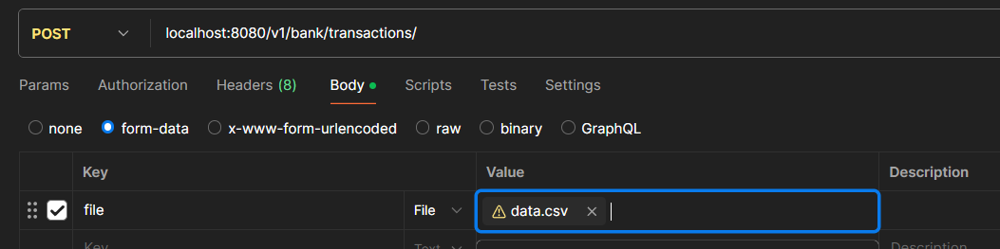

## About
Service which sole purpose is to manage bank account balance via Rest API

## Technologies:
Java 21
H2
Liquibase
MyBatis
Lombok
Opencsv

## Package structure
api - api 
domain - business logic layer
persistence - db layer

## 1.1 Endpoints

### 1.1.1 POST /v1/bank/transactions/
**Description:**
This endpoint allows users to import a bank statement in a predefined format in csv file. The statement will be 
processed and added to the system.
Data for import example can be found in "src/main/resources/static/data.csv" 


### 1.1.2 GET /v1/bank/transactions/
**Description:**
Endpoint which accepts params: dateFrom (optional) and dateTo (optional). Exports bank statement for one or several bank
accounts via CSV.


### 1.1.3 GET /v1/bank/balance/
**Description:**
Calculate account balance for a given date. Accepts: accountNumber (mandatory), dateFrom (optional), dateTo (optional)


## 2. Project setup

### 2.1. Building the application

In the project root directory run:

```shell
mvn clean package
```

### 2.2. Running the application

In the project root directory run:

```shell
mvn spring-boot:run
```

### 2.3. Running the application with IntelliJ

1. In Spring Boot Run/Debug Configuration
   select `src/main/java/inventi/challenge/ChallangeApplication.java`
   class and press **"Run"** button.

## TODO ##
add indexes to db tables
add user to link with account
add currency_rate if transaction is made from one currency to another
count balance in db per every new transaction
unit tests